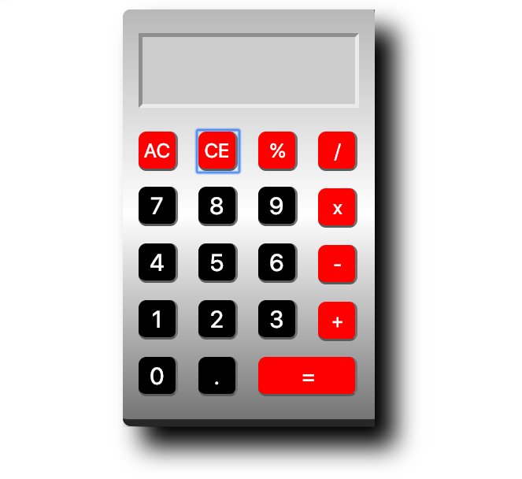

# jsCalculator
Basic calculator written in JavaScript

This calculator was written in Javascript and utilizes the jQuery library.
# Install
Clone or download this respository 
Open the index.html file on your computer

# Screenshot

